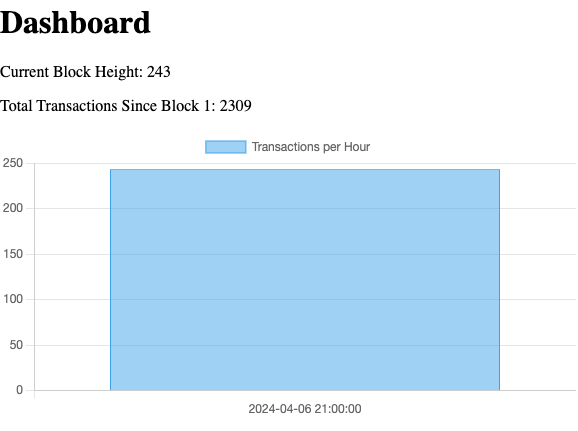

# gnoland-metrics

Displays a dasbhoard fed by the graphql endpoint [tx-indexer](https://github.com/gnolang/tx-indexer) of simple gno.land metrics.

## Binary Usage

```bash
./gnoland-metrics -jsonrpc-url=http://localhost:8545/query
```

## Docker Usage

```bash
docker run -it -p 8080:8080 \
  ghcr.io/orcutt989/gnoland-metrics:latest \
  -jsonrpc-url=http://localhost:8545/query
```
